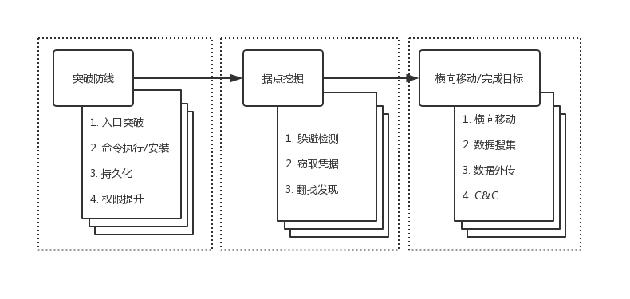
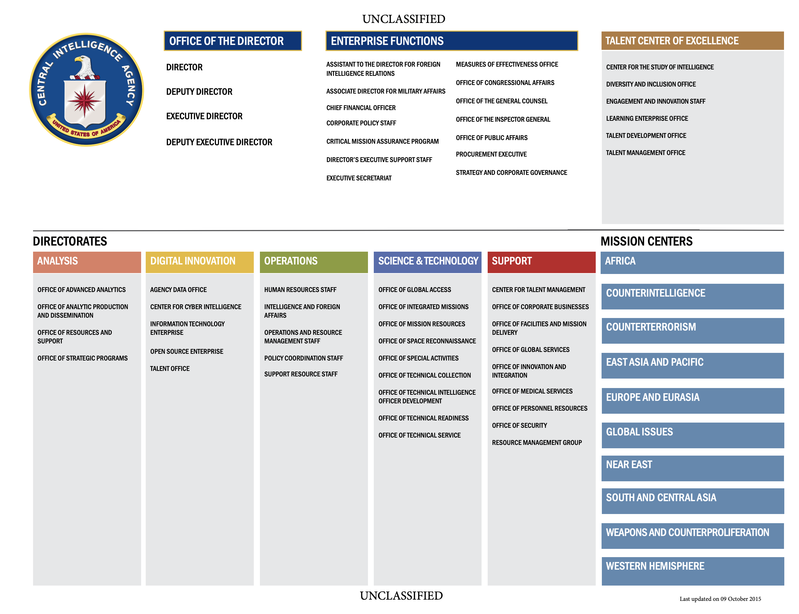

## 0. 前言

最近几年一直在做网络安全攻防相关的工作，从威胁情报、DDoS攻防、风控基础技术攻防、APT红蓝对抗等方向，基本覆盖了基础安全的几个主要场景，算是泛蓝军相关的内容，目标都是以攻击带动促进安全建设。

从实际项目来看，很多攻防的需求，前期都是因为现状不清晰、防护检测效果无法衡量、策略有缺漏、策略人员对防护场景认知不全面，或是对抗战场的升级，外部黑灰产的技术发展、真实对抗日趋激烈、需要拓展防守视野和能力，从而引进蓝军攻击团队进行场景的梳理、对现有安全体系的评估和对抗提升。当防御建设到一定程度之后，也需要蓝军挖掘更多的攻击面和风险盲点，并相对客观的评价当前防御体系的水平和攻击成本。

本文主要从入侵检测方向的红蓝攻防演练切入，分享一下对于互联网企业安全中企业蓝军建设的经验和想法，仅代表个人观点，欢迎交流指正。

## 1. 什么是蓝军

蓝军（国外称为红队 RedTeam），在军事上指部队模拟对抗演习中专门扮演假想敌的部队，可以模仿任何一支军队与我方正面部队进行针对性的训练。

蓝军旨在实现全场景、多层次的攻击模拟，来衡量企业人员、网络、应用、物理安全控制和防护体系在面对真实攻击时的防御水平，另外一个重要的意义在于拓宽防守方的视野，攻守相长。

众所周知，网络安全威胁形势是不断动态变化的，而很多企业内部安全体系中缺乏蓝军建设，导致承载业务高速发展的安全地基尚处于强度未知的状态。与传统渗透测试相比，红蓝对抗中的蓝军演练更接近真实的攻击，可能包含在线业务、企业人员、合作方、供应商、办公环境、物理楼宇、数据中心等等多样化的攻击形式。

## 2. 进攻是最好的防守

企业安全为什么需要蓝军？我们可以从这几点观察一下蓝军存在的价值和职责。

- 检验安全态势和防护水平

红蓝对抗可以检验企业安全防护体系：防护阻断、检测感知、响应溯源的能力，同时暴露防御脆弱点和业务风险盲点，从而针对性的优化和提升防护系统和消除业务风险，完成安全闭环。作为一个相对独立的第三方，蓝军可以客观的评价反入侵建设水平，用攻防实践来检验安全水平高低。

- 梳理风险盲点和攻防场景

蓝军可以理清防护标的所面临的风险、可能存在的攻击面，像攻击者一样思考。不断积累并挖掘多样化的攻击面，对于每个攻击面梳理可能的攻击路径，将攻击路径根据杀伤链的各个环节，分离出关键场景。在暴露风险盲点的同时，蓝军团队一方面需要持续绘制出清晰的攻防场景地图，另一方面也可以为防御建设提供有价值的优先级和技术建议。

- 安全价值的体现

在一次深度的红蓝对抗演习中，蓝军会尽最大可能的去暴露和挖掘安全风险的危害，这是对内部安全建设价值的一个强有力体现。安全所具备的价值与所防护业务的价值密切相关，另外外部威胁和攻击者的强弱也决定了安全的投入。蓝军的攻击目标往往是企业的核心业务和数据，通过扮演了一个外部攻击者的角色，可以正面反映出安全投入的必要，也证明了安全工作和防守方的价值。

- 强化业务同事安全意识

一次攻防演练往往能让各方更加直观的感受到攻击现场，强化业务同事、甚至防守方安全人员的安全意识。

## 3. 蓝军工作如何开展和考核？

蓝军的核心目标只有一个：贴近实战，模拟真实的攻击者。工作方向可以分别聚焦于攻击的深度、广度上。

深度，指完成指定攻击目标的完整攻击演习，暴露各种未知攻击面。在深度方向上，侧重于攻击过程的完成度，以及演习过程中的隐蔽性、躲避检测的能力。蓝军需要描绘的是一个完整的攻击故事，而不仅是单纯的发现漏洞和风险。广度，是指研究和梳理所有的攻击手法和攻防场景，并持续补充完善。重点在于攻击路径的、攻防场景的全面覆盖。

蓝军工作的核心指标有很多，这些指标可以是关于红蓝双方的：

- **入侵发现率**。入侵发现率是一个很重要的指标，但并不是全部。很多人对攻防的理解可能是：攻击被发现则表示任务失败。而真实攻击过程中，单纯的发现并不能阻碍攻击者的活动，还要考验的是防守方的应急响应能力。被发现之后蓝军还可以继续行动，通过持久化后门或者其他攻击面进一步突破防线继续入侵。

- **攻防场景发现率**。纵深防御体系对攻击路径上每一个关键场景是否有感知和响应。

- **攻击覆盖度**。攻击演习手法对已知攻防场景的覆盖情况。

- **演习频次/安全风险数/策略缺陷数/效率提升**。这些数值可以比较量化的体现红蓝对抗工作的效果：防护策略提升、响应效率提升、业务风险收敛。

- **攻击成本**。多次渗透环比来看攻击成本的变化，达成目标所花费的时间，难度。

- **目标达成率**。攻击目标达成情况。渗透蓝军来说目标通常是主机权限或者敏感数据。

蓝军工作可以根据需要分别从现网真实环境和测试环境发起。**测试环境**可以用于快速检验安全系统发现率和安全策略的场景覆盖情况。**真实环境**用于实施完整的攻击行动，发现风险盲点。很多风险盲点只有在现网中才会被暴露，比如说一个通用的配置失误，网络区域历史隔离问题，甚至完全未纳入过管控的未知资产等等。“安全就是指隐患都被人藏好了”，而蓝军正是需要挖掘出这些隐患。

就攻防场景而言，比如对命令执行、Webshell、持久化后门、权限提升、横向移动、端口扫描、C2C通信等等关键行为的检测策略，蓝军可以在测试环境快速对这些策略进行对抗与反向检验。而对于攻击面，比如内部核心业务区域、线上业务、企业人员、办公环境、数据接口、合作方、供应链、网络基础设施等等则需要真实环境的对抗，这也会检验防御方对于异常行为关联分析和告警的能力，而不仅是一个个孤立的黑特征告警。

红蓝对抗相比渗透测试而言，攻守视野相对要求更高，作战双方是“红军”和“蓝军”。蓝军需要考虑如何掌控战场、隐蔽和奇袭，从战术层指定攻击策略，不限制于具体的技术手法，不是单兵作战。如果能一招制敌，弱口令为什么不能出奇制胜？

**复盘**，也是红蓝对抗的重点之一。将蓝军渗透过程中的所有关键行为与红军检测记录到的数据进行对账，思考怎么样提高入侵感知能力，怎么样提高应急响应效率，怎么样提高入侵攻击成本，怎么样提高攻击溯源能力，怎样举一反三消除同类业务风险等等。提出优化建议，建设纵深立体的防御体系。

红蓝对抗工作开展过程中，要求攻守双方是“背靠背”方式开展对抗演练，而不是预先通知的逢场作戏。比如，限定攻击时间和攻击入口，防守人员严阵以待、一条一条人肉过日志、封IP，这样并非长久之计，不能体现出防御系统的一般水平。作为蓝军，我们有发起战斗的优先权，可以选择什么时候发起攻击，具有隐蔽性，突然性的特点。这种对抗也要求蓝军快速获取或者研究新型攻击手法的能力，形成不对称的打击优势，不断尝试将新的技术融入到“攻防演练“里。

除了技术层面的工作之外，蓝军还需要内部的品牌和影响力运营，做到每次出击都师出有名。这里暂不细表。另外在内部演习中也要保证和业务同事知会到位，演习实施过程中**严格控制风险**，避免对线上业务造成影响。

大型互联网企业蓝军的最终目标一定是能模拟国家级的APT攻击，防守方亦需达到反APT的水平。比如办公网安全、供应链安全、合作方安全、企业基础设施安全、物理安全，也必须是要涉及的对抗场景。当然也可以根据企业需求，适当的引入外部安全力量进行交叉演习。

## 4. 能力提升和个人成长

随着技术和对抗的升级，蓝军的角色、能力、战场也是不断转变的。围绕着核心数据资产，从早期的对抗脚本小子到对抗APT黑客，从Web漏洞扫描到纵深防御体系对抗。蓝军核心价值是仿真，所以必须对外部攻击形势和风险有清晰的认知：谁在攻击、攻击什么、攻击动机、攻击手法。了解真实世界的攻击者，是蓝军需要具备的核心能力之一。

广泛的情报来源有助于我们更深入及时的掌握攻击趋势，各种APT事件和调查报告是一个很好的情报来源。通过APT事件中的蛛丝马迹可以提取攻击者的一些行为特点：突破防线的手法、远控木马的行为，数据回传通信方式、攻击的目标以及一些已捕获的IOC信息。目前公开的报告大部分停留在对攻击入口相关样本的分析，包括鱼叉攻击中的诱饵文档、驻留木马等等。曝光出来的攻击入口以鱼叉邮件植入远程控制木马为主，可能有少量攻击员工手机或者攻击对外网站的案例，然而真实的攻击入口远比想象的更多。涉及内网横向移动细节的案例显得非常珍贵，这部分是后渗透阶段非常重要的一环，蓝军团队可以多关注一些完整的渗透案例，比如2015年的HackingTeam入侵事件、2017年FlexiSPY源码泄露事件、NSA方程式武器库泄露、CIA泄密资料等等。这里推荐一个开源项目：[APT Notes](https://github.com/aptnotes/data)，它记录了历年来的APT报道和分析文章。我在博客中也会不定期更新一些安全事件索引：<https://kingx.me/latest-events/>。

业内创新型的网络安全产品和议题则代表了防御检测方向探索的先驱，也可以给红蓝对抗和内部安全体系的提升带来很多新的思路。比如，Cybersecurity Ventures的网络安全创新企业Top500，一年一度RSA大会上的创新沙盒竞赛，BlackHat会议，或者Cylance、CrowdStrike结合人工智能的创新型EDR产品等等。

另外，蓝军团队需要沉淀出一套体系化的攻击手法知识库和武器库。MITRE出品的ATT&CK Matrix项目是一个很好的参考（MITRE是美国的非盈利组织，CVE项目的维护方。[ATT&CK Matrix](https://attack.mitre.org/techniques/enterprise/)项目基于全球真实入侵事件，罗列了APT组织使用的战术和技术的知识库）。2018年我们完成了对APT攻击矩阵的完整梳理和扩展，并且对内部策略进行了针对性的检验。简化后的攻击框架如下：

梳理过程是获益匪浅的，将零碎的知识点串联起来，这对于蓝军团队成员的个人技术成长和认知也有很大提升。形成框架之后可以不断研究补充其中的细节，并完善相应的武器库。

国家级APT能力不仅依赖全方位完善的后端体系支撑，更需要全平台、自动化、模块化的网络攻击军火库装备体系。管窥2017年曝光的CIA Vault7资料，至少还有0day漏洞挖掘、开源情报、武器研发、自动化植入、嵌入式设备、网络设备、操作系统利用、移动漏洞利用、无线入侵等等方向都是蓝军可以踏足并研究提升的领域和方向。当然，这是一个非常庞大的工程了。

## 5. 挑战

- 效率、收益

现代化高级网络攻击者在投放威胁载荷时明显表现出更多的耐心，与高频的暴力破解相比，更偏向于慢速、有针对的口令尝试。花更多的时间去了解攻击目标，寻找目标企业在安全链条中最薄弱的一环进行攻击。长期潜伏也是高级攻击者的一个风格偏向。然而内部蓝军和红蓝对抗最终还是要为企业服务，目标是为了保持企业的商业竞争力和利益。在综合考量ROI的前提下，企业不会允许不计时间成本的攻击，所以在保证一定效率的同时，攻击场景会相对灵活。有可能外网社工花很长时间突破到内网，最终价值可能还不如一次群发的办公网钓鱼邮件演习。那进行外网渗透还是从内网渗透呢？我认为两者都是需要去做的，只是频次和形式上会有些差异。

- 攻击成本量化

如何将攻击成本量化是一个很大的挑战。从攻击成果上来看，只有成功和失败两种结果。而攻击的人力和时间成本则存在较大的主观因素和不稳定性。

- 来自业务的挑战

有时候有人会问：攻防演习暴露出来的问题非常严重，那是不是还有很多演习中没有暴露的未知风险呢？

乍一听竟无言以对。安全是动态的概念，所有百分之百的固若金汤被打脸只是时间和成本问题。既然未知风险是必然存在的，那上面这个问题其实就是并没有什么意义了。一次演习不能暴露所有问题，更多的意义在于暴露出风险点，在后续的复盘中举一反三推动一类问题的解决。比如，演习中一台服务器Redis未授权访问导致了主机失陷，最终达成攻击目标。那么后续要关注的可能是未授权访问这类问题的解决、网络访问控制策略的加强等等，而不单单是解决Redis这个漏洞。所以蓝军工作的完美开展与业务侧的配合肯定是分不开的，一定要联合业务侧推动，**核心目标是为业务保驾护航，**演习也需要周期性的持续进行。

## 6. 展望与产品化思考

- 多层次全范围的蓝军

在未来可预见的时间范围内，蓝军演习肯定会向APT方向发展，时间跨度更大，更加隐蔽。多层次的蓝军演习可能包含渗透测试（线上业务、网络设备、移动端）、社会工程（网络、电话、邮件、聊天）、物理入侵（逃避摄像头、绕过警报）等等。蓝军团队需要各个方向的专家，比如渗透测试专家、物理入侵专家、社会工程专家等等，从物理、网络、系统、应用、业务、数据等各个层面展开立体的对抗。演习内容更加复杂，更贴近实战。

- 自动化产品

面对大型互联网企业内部成千上百万的服务器资产和众多的业务类型，自动化渗透平台必然是趋势。将自动化信息搜集、漏洞发现、漏洞利用、防御规则绕过、木马驻留、持久化控制等渗透杀伤链各个环节实现自动化，形成自动化渗透能力。

这里和传统漏洞扫描器是有一定区别的，服务器数量众多从来不是蓝军的挑战。正是因为数量众多，就存在着更多的攻击面。蓝军自动化攻击平台的重点在于自动化与协作，而不是规模化。

快速发现攻击入侵路径是自动化平台需要解决的问题。不在于一键获取权限，而是一个蓝军团队协同作战的平台，信息共享和关联。渗透涉及到的信息错综复杂，比如外网IP、端口、服务、应用指纹、证书、域名、子域名、人员姓名、邮箱、内网IP、软件信息等等，我们也一直在尝试这块的自动化工作。不断沉淀和积累，将能力沉淀到系统或者平台上。

- 蓝军能力对外输出

在如今万物互联的生态中，大家除了在业务环节实现相互连接外，底层基础的安全技术能力、数据和接口也必须相互开放和连接，共同打造公共基础安全平台和能力。相信各大企业的内部蓝军也会逐渐“走出去”，共建网络安全生态体系。只有共享的安全能力渗透到产业链的每一个环节，才能确保更立体，更全面的安全，才能保障“互联网+”的健康发展。

**在互联网生态高速发展的现在，个人信息和数据安全越来越受到重视，安全是大型互联网公司所有业务的生命线。反入侵更是基础安全领域的重中之重，各大互联网企业无时无刻不面临着全球黑客甚至是国家队的定向攻击，一旦出现重大事件，对商业品牌会造成无法挽救的损失。我相信安全蓝军和红蓝对抗的形式会继续在旷日持久的安全战场上发挥重要作用。**
